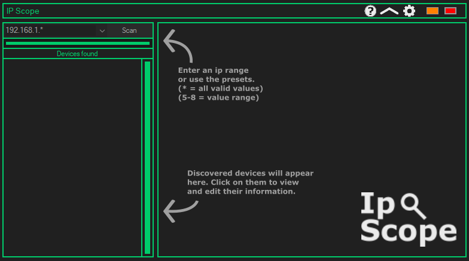
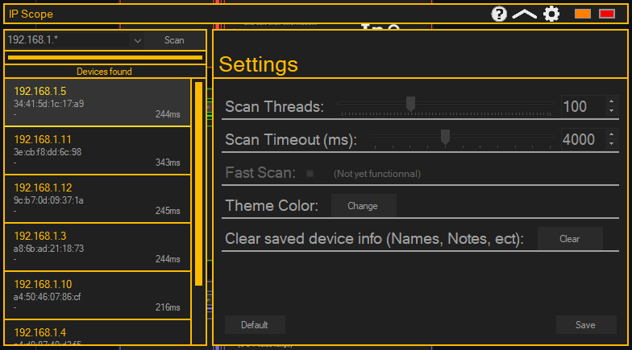
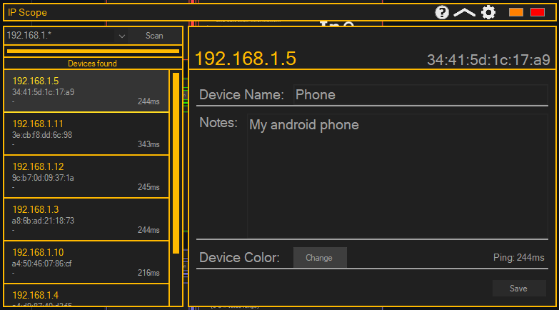
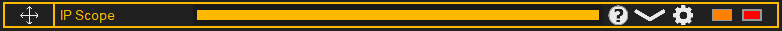
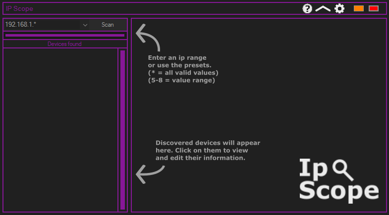
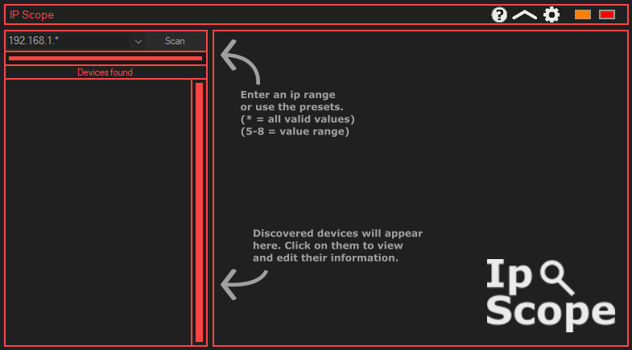
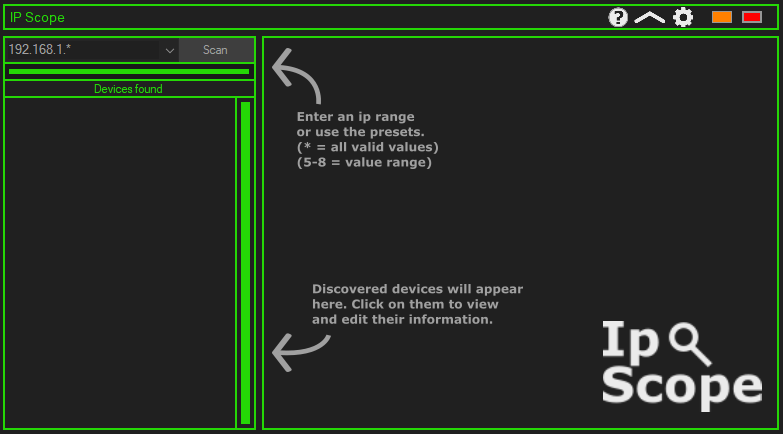
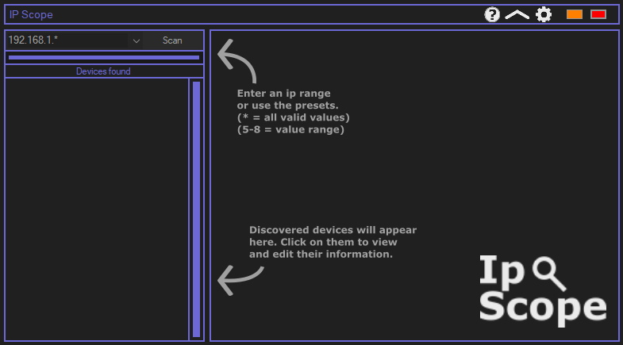

<!--
*** Thanks for checking out the Best-README-Template. If you have a suggestion
*** that would make this better, please fork the repo and create a pull request
*** or simply open an issue with the tag "enhancement".
*** Thanks again! Now go create something AMAZING! :D
-->


<!-- PROJECT SHIELDS -->
<!--
*** I'm using markdown "reference style" links for readability.
*** Reference links are enclosed in brackets [ ] instead of parentheses ( ).
*** See the bottom of this document for the declaration of the reference variables
*** for contributors-url, forks-url, etc. This is an optional, concise syntax you may use.
*** https://www.markdownguide.org/basic-syntax/#reference-style-links
-->

<!-- PROJECT LOGO -->
<br />
<p align="center">
  <a href="https://github.com/Simkoop/IP-Scope">
    
  </a>

  <h3 align="center">Simple IP Scanner</h3>

  <p align="center">
    A small, fast and feature rich IP Scanner
    <br />
    <a href="https://github.com/Simkoop/IP-Scope/releases"><strong>Releases»</strong></a>
    <br />
  </p>
</p>


<!-- ABOUT THE PROJECT -->
## About The Project

A very simple and powerful IP Scanner for windows. It's simple to use, so everyone can use it.



Customizeable threads and timeout so you can find a perfect balance between speed and robustness.



Edit device info, which is saved accross sessions.



Compacts down to show just scan progress while it stays on top of all windows so you don't miss out on your scan results.



### UI

The UI adjusts to your windows accent, giving a presonalized feel to the UI.







<!-- GETTING STARTED -->
## Built With

* [.NET Framework](https://dotnet.microsoft.com/download/dotnet-framework)

### Prerequisites

  ```sh
  .NET Framework
  ```

### Installation

1. Download the .zip
2. Extract the folder
3. Run the program

<!-- USAGE EXAMPLES -->
## Usage

1. Adjust settings to your liking by clicking the settings icon in the top right
2. Then enter an IP Range 
   - You can add a wildcard using *
   - You can add a range using min-max
3. Press scan and wait for the results
4. Click on devices to view and edit their information
